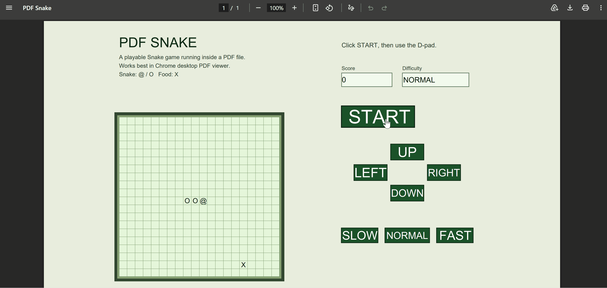

# PDF Snake

A playable Snake game running inside a PDF file.

No canvas. No HTML game engine. Just AcroForm fields, embedded JavaScript, and a cursed 20×20 text grid.

Works best in Chrome desktop PDF viewer.

Open `generated/playable-pdf-snake.pdf` in Chrome desktop, click START, then use the on-PDF direction buttons to play.

## Demo



## Install

```bash
npm install
```

## Generate the PDFs

```bash
npm run generate
```

Generated files:

- `generated/playable-pdf-snake.pdf`: portfolio/public distribution build
- `generated/snake.pdf`: stable development output kept for compatibility
- `generated/spike1_counter.pdf`: first spike proving that a PDF button can run JavaScript and update a text field
- `generated/spike2_motion.pdf`: second spike proving that row text fields can be updated repeatedly with `setInterval`
- `generated/spike3_direction.pdf`: third spike proving that direction buttons can update shared game state
- `generated/spike4_cell_color.pdf`: fourth spike showing that runtime `fillColor` updates may not repaint reliably in Chrome PDF viewer
- `generated/spike5_cell_text.pdf`: fifth spike proving that JavaScript-updated cell values are visible in Chrome PDF viewer

## Open in Chrome

1. Run `npm run generate`.
2. Open `generated/playable-pdf-snake.pdf` in Chrome desktop.
3. Click START.
4. Use UP, DOWN, LEFT, and RIGHT to steer.
5. Use SLOW, NORMAL, and FAST to change the game speed.

## Supported Environment

Best supported:

- Chrome desktop PDF viewer

Not supported or not recommended:

- Mobile PDF viewers
- Browser PDF viewers that disable PDF JavaScript
- PDF readers that support AcroForm display but do not support JavaScript timers
- Security-hardened PDF environments where form JavaScript is blocked

## How It Works

The public PDF uses a compact custom 16:9 page, 900 by 506pt, so the board and controls fit in one Chrome view more reliably than the earlier A4 and 960 by 540pt layouts. The left column contains the title, short notes, and the 20 by 20 board. The right column contains score, difficulty, START, D-pad, and speed controls. In v0.4.8, the board and control panel are centered as one content group so the page does not feel left-heavy at 100% zoom.

The board uses a static grid plus text-overlay renderer. The grid lines are drawn directly into the PDF page, so they remain visible even when Chrome refreshes form field appearances. Each cell still has a tiny read-only AcroForm field named `cell_${row}_${col}`, but that field is borderless and only displays text. Runtime rendering changes cell values only: empty cells are `""`, snake body cells are `O`, snake heads are `@`, dead snake cells are `x`, and food is `X`.

Earlier spikes used a row text renderer: one text field per row, with characters such as `@`, `o`, `*`, and `.`. That approach was useful for proving the PDF game loop, but it looked like lined paper and depended on font proportions. The v0.4.3 public build keeps those spikes as prototype artifacts while using the square cell grid for the playable PDF.

Renderer history: v0.4.1 tried dynamic cell colors, but Chrome PDF viewer did not reliably repaint form field `fillColor` changes. v0.4.2 switched to cell text values. v0.4.3 moved to ASCII-only symbols because Unicode glyphs can render inconsistently in PDF form fields. v0.4.4 used clearer ASCII `O` and `X`, a landscape two-column layout, and slower tick intervals. v0.4.5 replaced A4 landscape with a compact 960 by 540pt page. v0.4.6 moved grid lines out of form fields and into static page graphics. v0.4.7 uses `@` for the snake head, adds a short ASCII death blink, and draws GAME OVER directly inside the grid. v0.4.8 reduces the page to 900 by 506pt and recenters the two-column content group for a better Chrome 100% view.

The Snake logic uses one `GRID_SIZE = 20` constant for cell generation, movement, food placement, rendering, and collision checks. Snake segments use `{row, col}` coordinates so the game state maps directly to `cell_${row}_${col}` fields.

The START, direction, and difficulty controls are AcroForm buttons. Each button runs a small JavaScript action inside the PDF. START initializes or restarts the game, the direction buttons update the pending snake direction, and SLOW/NORMAL/FAST change the timer interval.

The game loop uses PDF JavaScript's `app.setInterval` to move the snake, place food, update the score, detect collisions, and rewrite cell values. On collision, the game stops the movement timer, runs a short death animation that alternates normal snake text with `x` cells, then clears the board and writes GAME / OVER inside the 20 by 20 grid. The public UI intentionally omits a Status field to keep the controls simple.

For a non-technical walkthrough, see `docs/how-it-works.md`.

## Test

```bash
npm test
```

The test command builds the TypeScript project, regenerates all PDFs, verifies that `spike5_cell_text.pdf` exists, and checks that the public Snake PDF contains the required 20 by 20 cell grid, score/difficulty fields, and START/UP/DOWN/LEFT/RIGHT/SLOW/NORMAL/FAST buttons.
